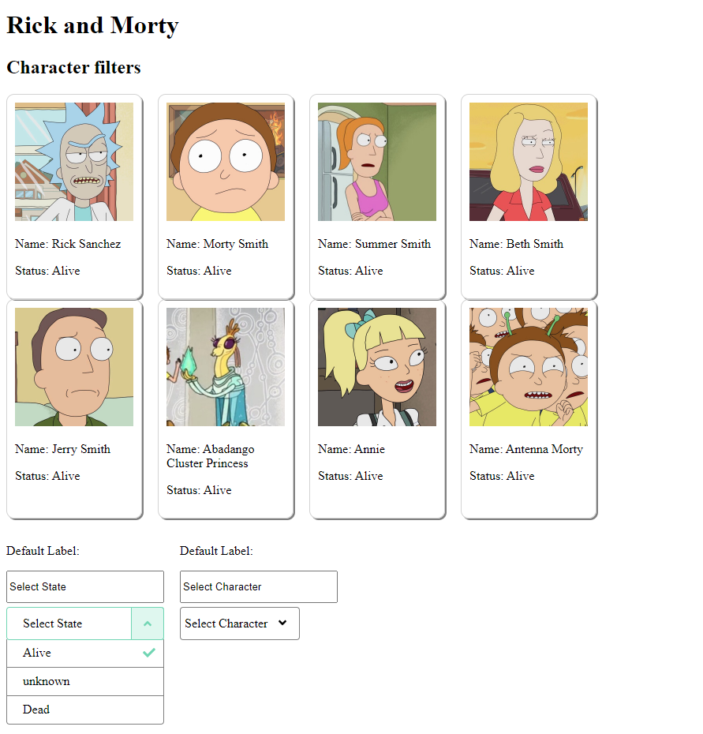

# Rick and Morty character selector

Hello!
This is a vue project used to check Rick and Morty's characters statuses and filter them.



The behavior is the following:
* The user can select from either dropdown the filter the characters by Status or the character itself.
* Both dropdowns are clickable, so you can open both, and toggle any of the given parameters at any time.
* On the upper section of the project, if there are any characters that meet the filtering criteria, they will appear
with an image, name and status

The project was built using the following tools versions:
```
- Node: 12.18.2 (npm 6.14.5)
- Vue 3.0.0
``` 

This project uses this service to feed its content:
[Rick and Morty API](https://rickandmortyapi.com/documentation/#rest)

Note: Since that API has a limit of calls one can do per X amount of time, I created a mock service which allows
us to mimic that same behavior. If this issue is encountered, you could change the line which calls the API, for the mock
service.

App.vue (line 81)
```
getAllCharacters().then(response => {
    ...
```

```
getAllCharactersMock().then(response => {
    ...
```
* Remember to import the new service. It exists in the same file.

## Project setup
In order to run the project, please run this command initially:
```
npm install
```

### Compiles and hot-reloads for development
To run this on your local server
```
npm run serve
```

### Compiles and minifies for production
```
npm run build
```

### Run unit testing (WIP, not finished yet)
```
npm run test:unit
```

### Customize configuration
See [Configuration Reference](https://cli.vuejs.org/config/).
